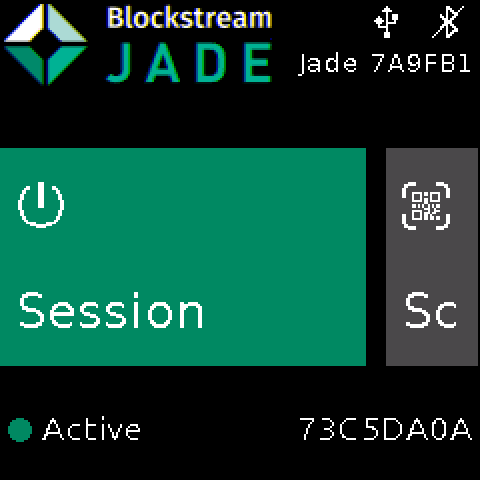
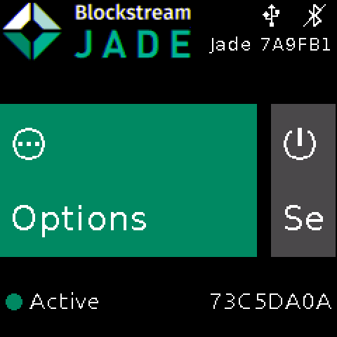

# piJade

**An airgapped Bitcoin hardware wallet built on a Raspberry Pi Zero, where the only cable that
reaches the device is power and everything else travels by QR code.**

  
  
  

<em>Emulator screens of the home menu.</em>

piJade is a fork of the [Blockstream Jade](https://github.com/Blockstream/Jade) firmware. Jade's
wallet, its screens and its cryptography are kept; what changes is the hardware underneath and the
way the device talks to the outside world. Jade is an ESP32 device that speaks over USB or
Bluetooth. piJade runs on a Raspberry Pi Zero whose radio hardware is cut or absent, and every
exchange upstream drives over a cable is carried by a QR code instead.

> **This is experimental work.** The device is not used with real funds; testing is done on
> testnet or with an empty wallet. The code in this repository has not had an independent security
> audit.

---

## Contents

- [What it does](#what-it-does)
- [What you need](#what-you-need)
- [Getting started](#getting-started)
- [Documentation](#documentation)
- [Relationship with upstream Jade](#relationship-with-upstream-jade)
- [Licence](#licence)

---

## What it does

**Holding a wallet**

- A **temporary wallet** lives in RAM. It is loaded by scanning a SeedQR or by typing the words,
  and it is gone at power off or when Log Out is pressed; nothing about it reaches the card.
- A **PIN-unlocked wallet** is Jade's own scheme: the seed sits on the card encrypted, and the key
  that decrypts it is released by a remote server against the right PIN. That exchange goes by QR
  code here, so unlocking one needs an internet-connected companion device. A temporary wallet
  needs nothing but the device itself.
- A duress PIN erases the stored wallet when it is entered. It is held as a salt and a one-way
  verifier rather than in the clear, which is not the same as being deniable against someone who
  takes the card; the fork's own document says where that line falls.

**Creating a seed**

- The entropy source is chosen from a menu: the device CSPRNG, dice rolls, camera frames, or the
  dice and camera chains combined.
- Dice rolls are 50 for twelve words and 99 for twenty-four, hashed exactly the way SeedSigner
  hashes them, so a seed made here can be reproduced on independent hardware.
- The camera chain ends in the device CSPRNG, so the floor of the result is the CSPRNG and the
  camera is a layer on top of it.
- Collection runs to at least 50 frames and then waits for the user to end it. Flat frames,
  repeats and frames too close to the previous one are thrown away, so a sensor that has stopped
  producing usable images cannot quietly collapse the chain.

**Restoring and backing up**

- Twelve or twenty-four words, spelled out or given by their position in the BIP39 list.
- Compact and standard SeedQR, a BC-UR `crypto-bip39` phrase, or the words as plain text.
- **SeedXOR**: reassemble a seed from parts that are each themselves a valid mnemonic. Splitting
  offers two, three or four parts.
- **SLIP-39**: read Shamir shares of 20 or 33 words, entered by word or scanned as QR codes. The
  fork reads SLIP-39; it does not produce shares.
- A backup draws a SeedQR the device's own camera can read back, with a zoom step for copying the
  grid by hand and a closing check against the wallet it came from.

**Reading and signing**

- Single-frame QR codes, animated BC-UR sequences, and BBQr sequences. A finished BBQr transfer is
  routed on the file type its own header declares, so a PSBT is signed and a Coldcard multisig
  setup file goes to the text reader.
- An address scanned on its own is checked for ownership across accounts 0, 1 and 2 plus the
  account of the last xpub export, on the receive and the change branch alike.
- An xpub or a multisig wallet record gets a warning screen before its QR is drawn: whoever scans
  one can see every address and payment of that wallet from then on.

**What the cable used to do**

- The clock is set by a QR code drawn by a [helper page](https://ilkerbbb.github.io/piJade/clock)
  that keeps working once loaded, with the browser offline.
- A message is signed from a second [helper page](https://ilkerbbb.github.io/piJade/sign); the
  signature comes back on the screen as a QR code.
- Mining is started by scanning a block template QR, and a solved block comes back on the screen
  as a QR code. Nothing in this repository carries that QR to a node, and no block the device
  produced has been offered to one; `pijade/README.md` says what was measured and what was not.

## What you need

- A **Raspberry Pi Zero W with its WiFi and Bluetooth circuitry physically cut**, or a plain
  **Raspberry Pi Zero**, which carries no radio hardware to begin with. Everything here was
  measured on the cut Zero W.
- A **Waveshare 1.3" LCD HAT**: 240x240 pixels, three buttons and a joystick.
- A **camera** the host opens as `/dev/video0`.
- A **microSD card**, which holds the operating system, the piJade binaries and the settings file.

Neither board has a secure element or secure boot, so the card is readable by anyone who takes it.
What that means for a wallet kept on it is written out in the security audit.

## Getting started

The card is prepared with Docker, in three steps. A Raspberry Pi OS image is fetched and turned
into a build container that carries the target's own ARMv6 root filesystem, the piJade binaries
are built inside it, and a second container embeds them in a copy of that image, which is then
written to a microSD card. The first step refuses to start unless the image it was handed
matches its published fingerprint, and the last refuses unless the binaries match the hash it is
given; handing it that hash from the build log, rather than letting it read the one sitting next
to the package, is what makes the check an authenticity check. The chain, with the commands and
what each step checks, is in
[`pijade/README.md`](./pijade/README.md), which is also the document to read for how the device
is used once it boots.

## Documentation

| Where to look | What is there |
|---|---|
| [`pijade/README.md`](./pijade/README.md) | The fork's own document: the two boards, what the device does, and how a card is built and updated |
| [`pijade/UPSTREAM.md`](./pijade/UPSTREAM.md) | Every departure from upstream, a row for each text file, and the discipline for taking upstream updates into them |
| [`pijade/SECURITY-AUDIT-2026-09-03.md`](./pijade/SECURITY-AUDIT-2026-09-03.md) | The security audit: threat model, what was measured, what is deliberately not claimed |
| [`pijade/COMPARISON.md`](./pijade/COMPARISON.md) | This device set against SeedSigner, Coldcard, Passport, Trezor and Jade, and then SeedSigner row by row |
| [`SECURITY.md`](./SECURITY.md) | How to report a vulnerability, in this fork and in upstream Jade |
| [`JADE-BUILD.md`](./JADE-BUILD.md) | Blockstream Jade's own build document, for Jade's ESP32 hardware, kept as upstream wrote it |
| [set the clock](https://ilkerbbb.github.io/piJade/clock) and [sign a message](https://ilkerbbb.github.io/piJade/sign) | The helper pages that draw the QR codes the device reads; source under `docs/`, works offline |

## Relationship with upstream Jade

The fork tracks upstream and keeps the departure small enough to stay readable. Jade's own build
document, which covers the ESP32 boards and the toolchain they need, used to occupy most of this
README; it now sits in [`JADE-BUILD.md`](./JADE-BUILD.md), unchanged, and upstream's edits to it
are taken in there. Everything the fork alters is listed file by file in
[`pijade/UPSTREAM.md`](./pijade/UPSTREAM.md), which is the place to look before changing anything
upstream also maintains.

## Licence

Blockstream Jade is MIT licensed and this fork is under the same licence; the `LICENSE` file at
the root is untouched, as is the `COPYING` file upstream ships beside it. Upstream's own wording
is that the collection is subject to GPL3 while individual source components can be used under
their specific licences. Third-party code the fork brings in keeps its own licence, recorded where
it sits and listed in [`pijade/README.md`](./pijade/README.md).
